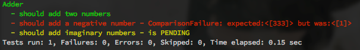

Lambda Spec
===========

Adding more λ to your Java Specs!

Testing may change it's looks with the addition of Lambdas in JDK8.
**LambdaTest** is giving you a taste of tomorrow... today!

LambdaTest is heavily influenced by my love to fluent APIs as well as
Bill Venners' **ScalaTest**, which I love and use on a daily basis.

Example
=======

```java
import pl.project13.test.lambda.exampleimpl.Adder;
import pl.project13.test.lambda.spec.set.ClassSpecSet;

import static org.fest.assertions.Assertions.assertThat;
import static pl.project13.test.lambda.SpecDSL.describe;

public class ClassSpecTest {

  // this `SpecSet` provides a new instance of the tested class for each `should`
  ClassSpecSet<Adder> it = describe(Adder.class);

  {
    it.should("add two numbers", adder -> {
      // given
      int a = 1;
      int b = 2;

      int expected = 3;

      // when
      int got = adder.add(a, b);

      // then
      assertThat(got).isEqualTo(expected);
    });

    it.should("add a negative number", adder -> {
      // given
      int a = -1;
      int b = 2;

      int expected = 333; // wrong `expected`, to demo failure logging

      // when
      int got = adder.add(a, b);

      // then
      assertThat(got).isEqualTo(expected);
    });

    it.should("add imaginary numbers", MarkAs.pending);
  }

  // currently LambdaSpec has no stand alone runner, so fire it up using JUnit
  @Test
  public void shouldPassAllTests() throws Exception {
    it.shouldPassAllTests();
  }
}
```

The console output would then look like this:



As you can see, the failure reporing is not yet implemented (it's JUnits report - one passed test),
this will be obviously replaced by an autonomous test runner within **LambdaTest**.

Requirements
============

Please note that Java 8 is actually quite far away, yet this is a working prototype.
The tests are currently launched as one JUnit test - until I write my own test reporter and runner.

* Java 8 (yes, I know it's going to be released around one year from now... ;-)).
* Maven - and the tests themselfs are started using JUnit

License
-------
This project is licensed under the **Apache Commons 2** License!
Feel free to submit patches - I merge stuff fast.

About me
--------
Fan of programming and type systems. Doer of things, who likes the the JVM.

Konrad Malawski @ java.pl -- 13 May 2013
